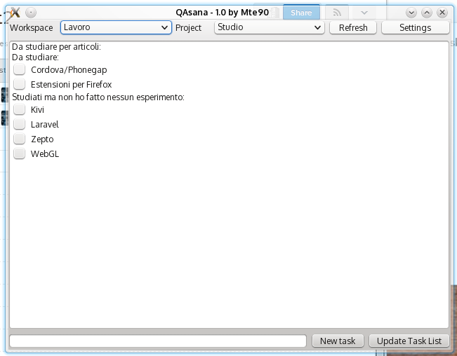

QAsana
======

Simple interface for Asana in Python(3)-Qt(4)  

Made it for show/hide with a hotkey in your DE.  

#Param

    qasana.py --hide

Silent start mode

#Installation

Now qAsana use the official Python bindings, to install:
   pip3 install asana

Require Xdotool for move and hide the window
   apt-get install xdotool