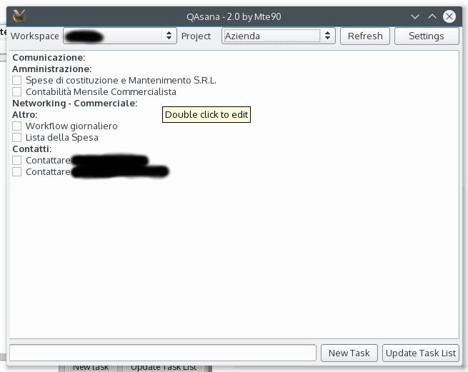

QAsana
======

Simple interface for Asana in Python(3)-Qt(4)

Made it for show/hide with a hotkey in your DE.  

#Param

    qasana.py --hide

Silent start mode

#Installation

Require the Python3 unofficial branch for the python wrapper of Asana API, download on https://github.com/codito/asana/tree/python3  
Extract the package and with root permission:
  python3 setup.py install

Require Xdotool for move and hide the window

